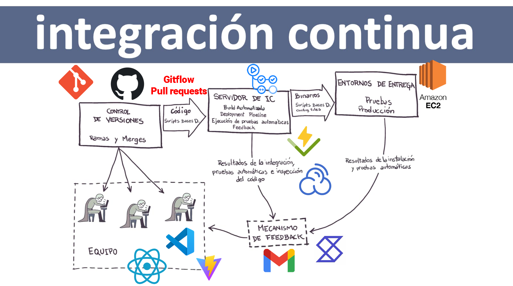

````markdown
# devoped-app

Este es el repositorio de **devoped-app**, una aplicación construída con las siguientes tecnologías:

- **Vite**: Bundler y dev server ultrarrápido para proyectos front-end.
- **React**: Biblioteca de JavaScript para construcción de interfaces de usuario.
- **JavaScript (ES6+)**: Lenguaje principal de la aplicación.
- **Vitest**: Framework de pruebas unitarias y de integración.

---

## 📂 Estructura del proyecto

```text
devoped-app/
├── .github/workflows/
│   └── node.js.yml   # Pipeline de CI
├── public/           # Archivos estáticos
├── src/              # Código fuente
│   ├── tests/        # Test de Vitest
│   └── App.jsx       # Componente raíz
├── .gitignore        # Archivos ignorados por Git
├── vite.config.js    # Configuración Vite
├── package.json      # Dependencias y scripts
└── README.md         # Documentación del proyecto
````

---

## 🚀 Instalación y uso

1. Clonar el repositorio:

   ```bash
   git clone https://github.com/lautarofaccini/devoped-app.git
   cd devoped-app
   ```
2. Instalar dependencias:

   ```bash
   npm install
   ```
3. Ejecutar en modo desarrollo:

   ```bash
   npm run dev
   ```
4. Compilar para producción:

   ```bash
   npm run build
   ```
5. Ejecutar test:

   ```bash
   npm test
   ```

---

## 🌿 Branch Management & Shortcut

El Branch Managment de este repositorio se realiza siguiendo las reglas de Gitflow.

Para vincular commits y ramas con historias de usuario en Shortcut, utilizamos el patrón `sc-<número>` (por ejemplo, `sc-12`).

1. **Crear una rama de feature**:

   ```bash
   git checkout -b sc-12-descripcion-corta
   ```

   * `sc-12` corresponde a la historia de usuario 12.
   * `descripcion-corta` describe el objetivo de la historia.

   Esto pasará la historia vinculada a `In Progress`

2. **Hacer commits**:

   ```bash
   git add .
   git commit -m "[sc-12] Añade componente de formulario de login"
   ```

   * El prefijo `sc-12` enlaza el commit con la historia de usuario.

3. **Subir la rama al remoto**:

   ```bash
   git push -u origin sc-12-descripcion-corta
   ```

4. **Abrir Pull Request (PR)**:

   * Ve al repositorio en GitHub.
   * Selecciona tu rama `sc-12-descripcion-corta`.
   * Crea un PR contra `develop`.

   Esto pasará la historia vinculada a `In Review`

5. **Revisiones y merge**:

   * Una vez aprobado, se realizará un merge

   Si pasan todos los tests, pasará la historia a `Done`

---

## 🌀 Pipeline de CI

